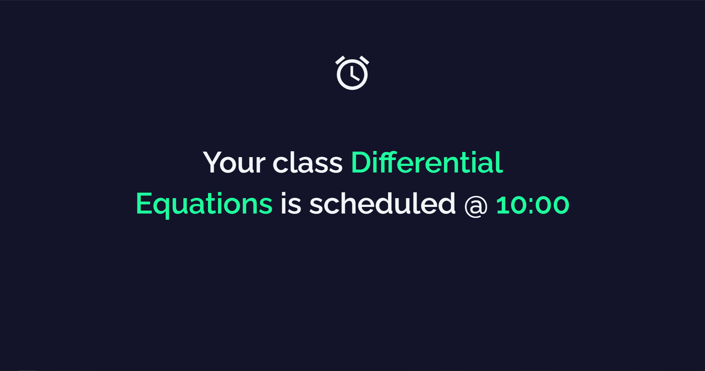
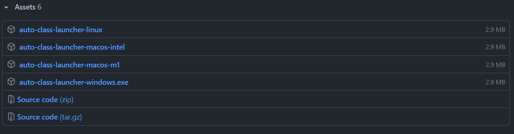
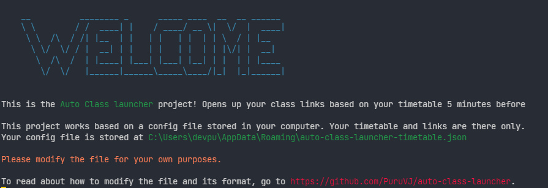

# Auto Class Launcher

This is a little script I wrote to launch my classes 5 minutes before! But it is highly customisable, and you can download it and use it for yourselves! Just feed it your timetable and it will work flawlessly.

# Features

- 🚀 Launches your class link 5 minutes before the time.
- ⏰ If link can't be provided, launches an alarm clock page for you
- Available for Windows, Linux and macOS(Intel and M1)



# Who is this for?

1. This tool will only be useful if you have same links for each subject throughout, and your weekly schedule is same. If it changes week to week, this script isn't for you.

2. The timetable is stored in a JSON file on your computer. **There's no Graphical User Interface**. You should know how to navigate your computer's filesystem, and have confidence in editing configuration files.

# Getting started

Go to the [Releases](https://github.com/PuruVJ/auto-class-launcher/releases) page. There, you'll see some files under the **Assets** section



These are all executable binary files. Click on the file suitable for your operating system

- If you're on **Ubuntu** or any other Linux, go for `class-launcher-linux` file
- If on **Windows**, go for `class-launcher-windows.exe`
- If on macOS
  - If you're on a MacBook/Mac with an Intel chip processor, go for `class-launcher-apple-intel`
  - If you're on the new M1 chip macBook/Mac, go for `class-launcher-apple-m1`

When you download your file, simply double click on it to run it. And that's it!! You're almost done.

# Editing the timetable

When you launch the program the first time, you'll see this screen



**The config file is located right next to this program you are running, and it's named `auto-class-launcher-timetable.json`**

So you open up the file, and you see this 👇

```json
{
  "disc-structures": {
    "link": "https://meet.google.com/txo-tvbd-zvt?authuser=2",
    "times": [
      {
        "day": "tue",
        "time": "12:00"
      },
      {
        "day": "wed",
        "time": "12:00"
      },
      {
        "day": "thu",
        "time": "11:00"
      },
      {
        "day": "fri",
        "time": "15:00"
      }
    ]
  },
  "eng-graphics": {
    "link": "https://meet.google.com/uaa-brhr-rwy?authuser=2",
    "times": [
      {
        "day": "mon",
        "time": "12:00"
      },
      {
        "day": "thu",
        "time": "14:00"
      },
      {
        "day": "mon",
        "time": "12:00"
      }
    ]
  },
  "env-design": {
    "times": [
      {
        "day": "sun",
        "time": "23:08"
      }
    ]
  }
}
```

What you see is the author's timetable here. You'll have to modify it to suit your own needs. As you can this follows the pattern:

```yaml
subject:
  link: "LINK TO OPEN"
  times:
    day: "The day of class. Can be mon or tue or wed or thu or fri or sat or sun"
    time: "hh:mm"
```

So all you have to do is change the subject names in it, the links, and the times.

## What if I don't have a link (Or link changes every once in a while)?

In that case, afraid you can't provide a link. But you can use the `Alarm Clock feature`. If you **don't provide a link**, but specify the times, it will automatically open up a webpage 5 minutes before reminding you that you have a class.


Example:

```json
"env-design": {
    "times": [
      {
        "day": "sun",
        "time": "23:08"
      }
    ]
  }
```

As you can see, the time is defined, but no link provided.
